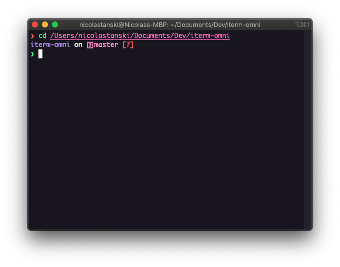

# Omni for [iTerm 2](http://iterm2.com)

> Omni is everywhere [iTerm 2](http://iterm2.com).



## Install

#### Clone this repo
```
git clone https://github.com/nicolastanski/iterm-omni.git
```

#### Activating theme
1. iTerm2 > Preferences > Profiles > Colors Tab
2. Open the Color Presets... drop-down in the bottom right corner
3. Select Import... from the list
4. Select the Omni.itermcolors file
5. Select the Omni from Color Presets...

## Tips

The screenshot shown is a combination of the following additional software:

- [Oh My Zsh](https://github.com/robbyrussell/oh-my-zsh)
- [Fast syntax highlighting](https://github.com/zdharma/fast-syntax-highlighting)

## Team

This theme is maintained by the Rockeseat.

[](https://github.com/nicolastanski) |
--- |
Nicolas Tanski |

## License

MIT License
